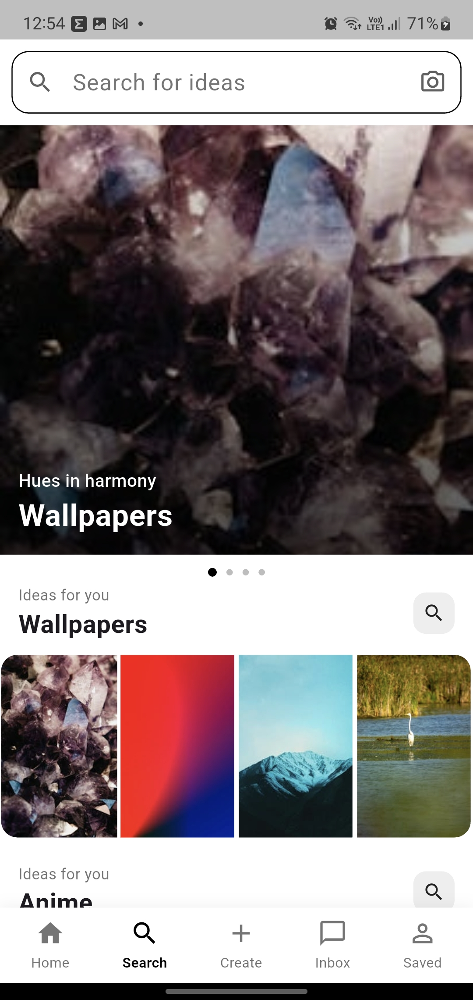

# Pinterest Clone Flutter

A beautiful Pinterest-inspired Flutter application with a modern masonry grid layout, smooth animations, and responsive UI. This project replicates the core UI experience of Pinterest while focusing on clean architecture and Flutter UI development.

---

## ✨ Features

- 📌 Pinterest-style staggered grid layout
- 📱 fast Image loading
- 🔍 Search UI
- ❤️ Interactive and modern UI
- ⚡ Smooth scrolling experience
- 📱 Responsive design for different screen sizes
- 🎨 Clean and minimal interface
- 🚀 Built completely using Flutter

---

## 📸 Screenshots

| Home Screen | Detail Screen |
|-------------|---------------|
|  |  |

| Search Screen | Option BottomSheet |
|---------------|----------------|
|  |  |


---

## 🛠️ Tech Stack

- Flutter
- Dart
- Masonry Grid View
- Material Design

---

## 📂 Folder Structure

```bash
lib/
│── core/
│── features/
│── widgets/
│── main.dart
```

---

## 🚀 Getting Started

### Prerequisites

Make sure you have installed:

- Flutter SDK
- Android Studio / VS Code
- Emulator or Physical Device

---

### Installation

Clone the repository:

```bash
git clone https://github.com/Abhay-Kumar-Dubey/pinterest-clone-flutter.git
```

Navigate to the project directory:

```bash
cd pinterest-clone-flutter
```

Install dependencies:

```bash
flutter pub get
```

Run the app:

```bash
flutter run
```

---

## 🎯 Purpose of the Project

This project was built to practice and improve Flutter UI development skills by recreating the Pinterest experience. It focuses mainly on responsive layouts, reusable widgets, smooth scrolling performance, and modern mobile UI design.

---

## 📌 Future Improvements

- Firebase integration
- User authentication using Clerk
- Rich images using Api calls
- Bookmark functionality

---

## 🤝 Contributing

Contributions are welcome. Feel free to fork the project and submit a pull request.

---

## ⭐ Support

If you like this project, consider giving it a star on GitHub ⭐

---

## 👨‍💻 Author

Abhay Kumar Dubey

- GitHub: https://github.com/Abhay-Kumar-Dubey
